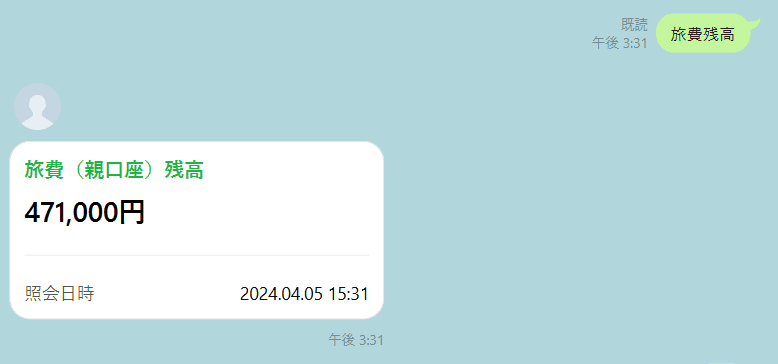
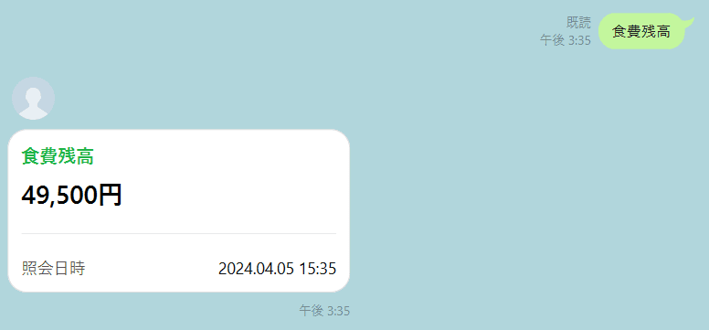
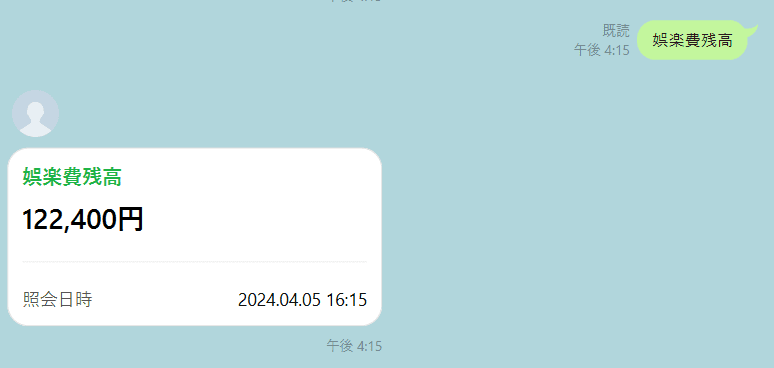
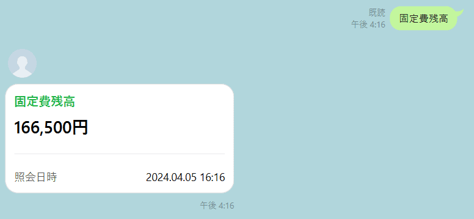
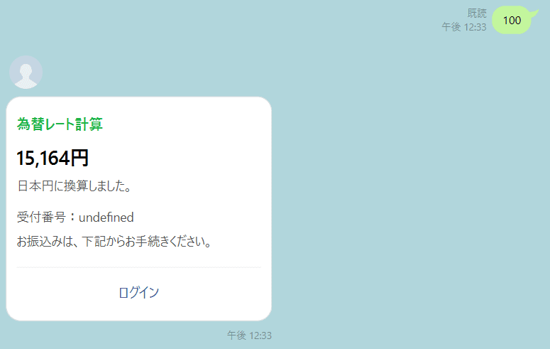
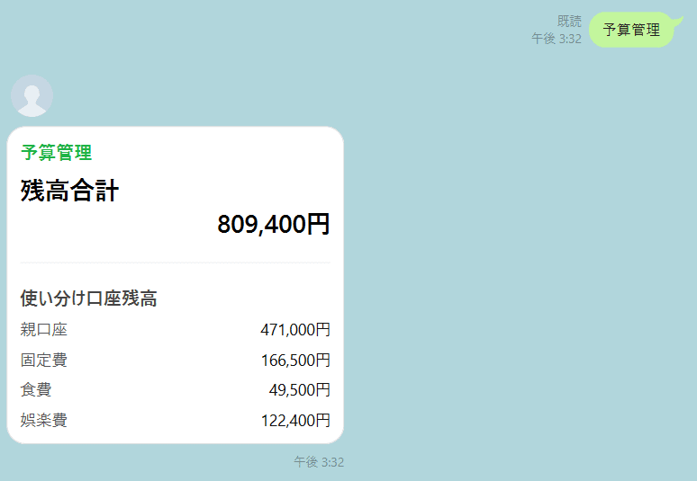

## サービス内容
- 海外旅行中に買い物をする際、デビットカード機能（想定）で支払い、残高参照、明細参照、つかいわけ口座を利用した予算管理ができる。また、商品の金額を入力すると、為替レート計算（今回はドル）ができる機能も実装した。

## 制作背景
- 海外旅行中に買い物をする際、為替計算をするのが大変だと感じたため
- 請求額がその場で確認できると便利だと感じたため
- 旅行の予算を決め、用途ごとに開設したつかいわけ口座からの支払い、残高管理、明細の閲覧ができるとよいと感じたため

## 技術選定
- LINE
- Messaging API
- 銀行API　sunabar（GMOあおぞらネット銀行様より）
- AWS Lambda
- JavaScript
- ※今回の開発では、開発環境がLambdaのため、それぞれのソースコードを共有するためにGitHubを使用しています。

## 機能   ユーザー送信内容と返信内容
- おはよう
    - おはようございます
    - スタンプ

- 明細
    - 日付別明細の参照

- 振込
    - 金額別振込  500、1000、2000、3000円

- 残高
    - 口座全体の残高

- 旅費残高
    - 旅費の親口座残高

- 食費残高
    - つかいわけ口座（食費）残高

- 娯楽費残高
    - つかいわけ口座（娯楽費）残高

- 固定費残高
    - つかいわけ口座（固定費）残高

- 数字（商品の金額）
    - 為替計算をした日本円の金額
    - 振込先リンク

- 予算管理
    - 口座全体、親口座、各つかいわけ口座の残高

- 上記以外の文言
    - 残高？振込？

## タスク管理、共有事項等
[Notion](https://www.notion.so/GMO-1af7554b551f4c2aa134bfcc0c3cc4a8)
